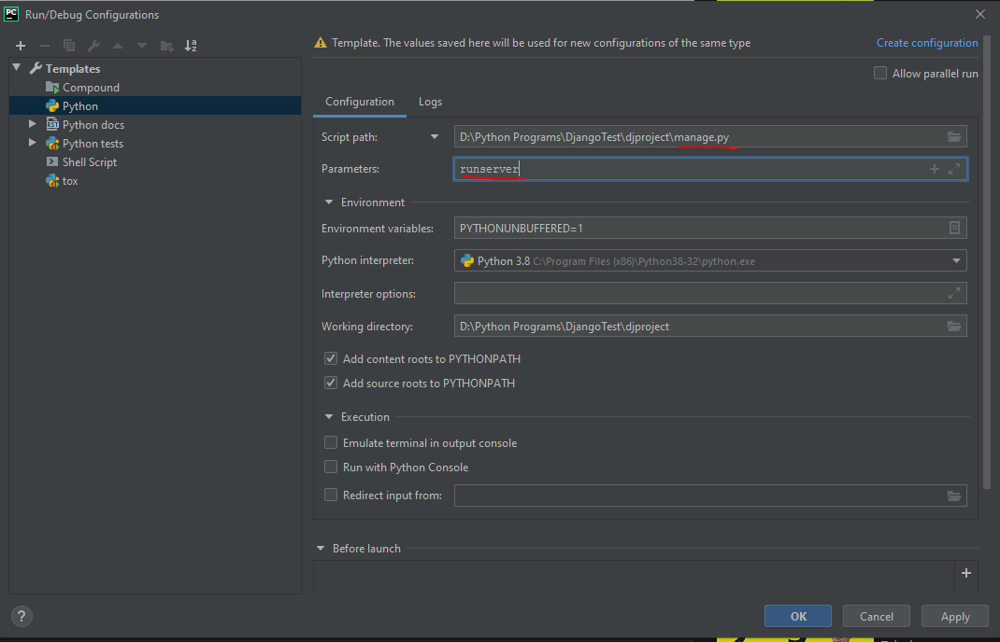

# Django Tutorial

### Setup
````shell script
$ pip3 install django
````

Create a new project
````shell script
$ django-admin startproject <PROJECT_NAME>
`````

###Running

####via terminal
````shell script
$ cd <PROJECT_NAME>
$ python3 manage.py runserver
````
Your terminal should display something like this...
````shell script
Watching for file changes with StatReloader
Performing system checks...

System check identified no issues (0 silenced).

You have 17 unapplied migration(s). Your project may not work properly until you apply the migrations for app(s): admin, auth, contenttypes, sessions.
Run 'python manage.py migrate' to apply them.

July 13, 2020 - 00:43:46
Django version 3.0.8, using settings 'djproject.settings'
Starting development server at http://127.0.0.1:8000/
Quit the server with CONTROL-C.
[13/Jul/2020 00:43:54] "GET / HTTP/1.1" 200 16351

````
Click on the url and you're done

####via Pycharm
- Click on Run > Edit Configurations
- Change the following
    - <b>Script Path:</b> path to <i>manage.py</i>
    - <b>Parameters:</b> <i>runserver</i>


- Click Apply and OK
- Right-click on manage.py and click 'run manage' 
- Click the link to the server URL


Success, you've installed Django for pycharm!